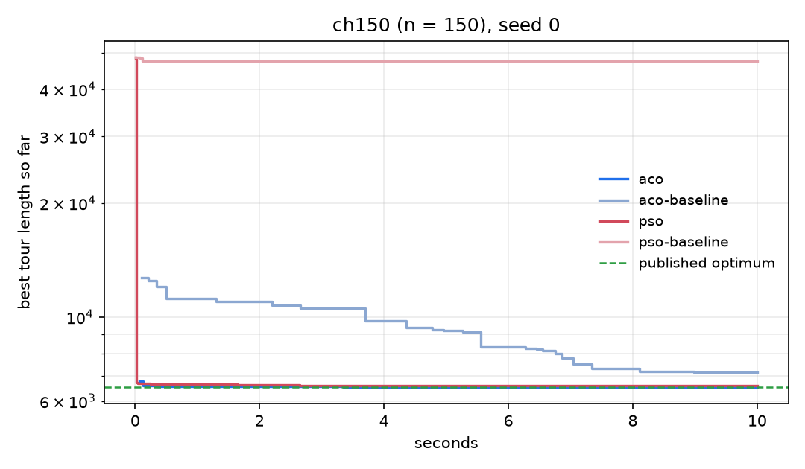
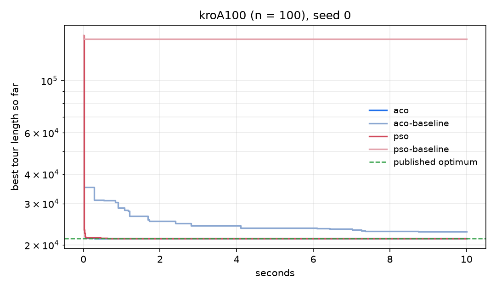
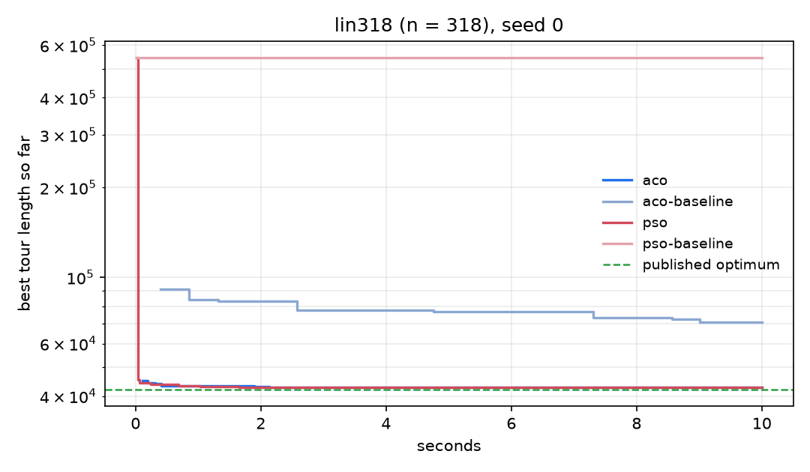
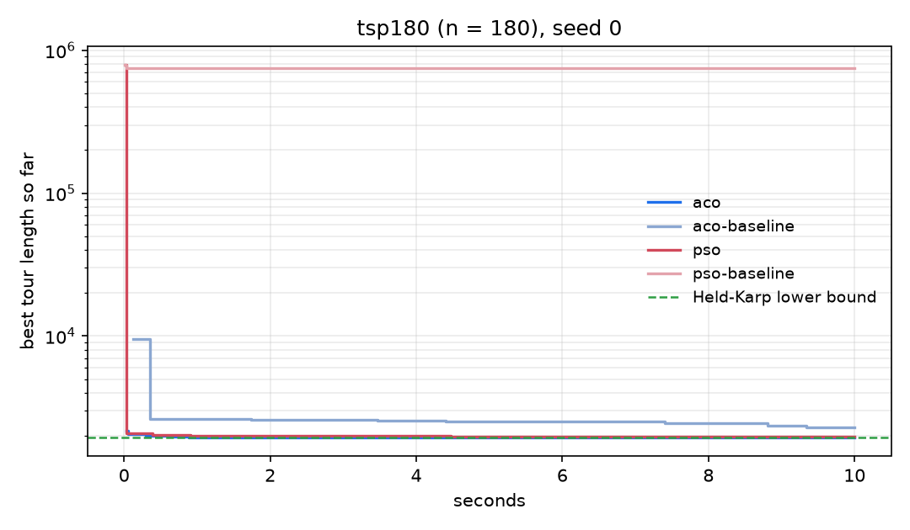

# TSP Swarm Optimisation

[](https://github.com/Hamz714/TSP-Optimisation-Algorithms/actions/workflows/ci.yml)
[](https://www.python.org/)
[](LICENSE)

Ant Colony Optimisation and Particle Swarm Optimisation for the symmetric travelling
salesman problem, written from scratch in pure Python with no third party dependencies in
the solvers. Both are hybridised with a candidate-list 2-opt and Or-opt local search, and
solution quality is certified against a Held-Karp lower bound computed by Lagrangian
relaxation, so every result below is a bounded claim.

<!--RESULT_SUMMARY-->

Across 18 instances of up to 783 cities, and taking the best of five seeds per instance, the ant colony reaches a mean gap of **0.38 %** and the particle swarm **0.72 %** against published optima or certified lower bounds. The search reaches the published optimum on **4 of 8** TSPLIB instances, and on **5 of 10** of the unlabelled instances it returns a tour whose length equals the computed lower bound, which proves those tours optimal.

<!--/RESULT_SUMMARY-->

## Contents

- [Results](#results)
- [Quick start](#quick-start)
- [The problem and the instances](#the-problem-and-the-instances)
- [Local search](#local-search)
- [Ant Colony Optimisation](#ant-colony-optimisation)
- [Particle Swarm Optimisation](#particle-swarm-optimisation)
- [Certifying quality: the Held-Karp lower bound](#certifying-quality-the-held-karp-lower-bound)
- [Ablation](#ablation)
- [Benchmark methodology](#benchmark-methodology)
- [Testing](#testing)
- [Repository layout](#repository-layout)
- [References](#references)

## Results

Best tour found over 5 seeds per instance. `reference` is the published optimum for the
TSPLIB instances; for the ten instances that ship only as anonymous distance matrices it is
the Held-Karp lower bound computed here, marked `*`, so those gaps are upper bounds on the
true gap rather than exact gaps.

<!--TABLE_HEADLINE-->

| instance | n   | reference | ACO best | ACO gap % | PSO best | PSO gap % | status                   |
| -------- | --: | --------: | -------: | --------: | -------: | --------: | -----------------------: |
| tsp012   |  12 |      56 * |       56 |      0.00 |       56 |      0.00 | optimal (certified here) |
| tsp017   |  17 |    1444 * |     1444 |      0.00 |     1444 |      0.00 | optimal (certified here) |
| tsp021   |  21 |    2549 * |     2549 |      0.00 |     2549 |      0.00 | optimal (certified here) |
| tsp026   |  26 |    1473 * |     1473 |      0.00 |     1473 |      0.00 | optimal (certified here) |
| tsp042   |  42 |    1187 * |     1187 |      0.00 |     1188 |      0.08 | optimal (certified here) |
| tsp048   |  48 |   12109 * |    12166 |      0.47 |    12282 |      1.43 |                          |
| berlin52 |  52 |      7542 |     7542 |      0.00 |     7542 |      0.00 |                  optimal |
| tsp058   |  58 |   25355 * |    25395 |      0.16 |    25395 |      0.16 |                          |
| eil76    |  76 |       538 |      538 |      0.00 |      541 |      0.56 |                  optimal |
| kroA100  | 100 |     21282 |    21282 |      0.00 |    21282 |      0.00 |                  optimal |
| ch150    | 150 |      6528 |     6528 |      0.00 |     6588 |      0.92 |                  optimal |
| tsp175   | 175 |   21369 * |    21407 |      0.18 |    21412 |      0.20 |                          |
| tsp180   | 180 |    1947 * |     1950 |      0.15 |     1980 |      1.69 |                          |
| d198     | 198 |     15780 |    15849 |      0.44 |    15833 |      0.34 |                          |
| lin318   | 318 |     42029 |    42290 |      0.62 |    42499 |      1.12 |                          |
| pcb442   | 442 |     50778 |    51454 |      1.33 |    51702 |      1.82 |                          |
| tsp535   | 535 |   48361 * |    48770 |      0.85 |    49167 |      1.67 |                          |
| rat783   | 783 |      8806 |     9043 |      2.69 |     9069 |      2.99 |                          |

<!--/TABLE_HEADLINE-->

Spread across seeds:

<!--TABLE_DISTRIBUTION-->

| instance | n   | algorithm | best  | mean    | sd    | mean gap % | s to best |
| -------- | --: | --------: | ----: | ------: | ----: | ---------: | --------: |
| tsp012   |  12 |       aco |    56 |    56.0 |   0.0 |       0.00 |       0.0 |
| tsp012   |  12 |       pso |    56 |    56.0 |   0.0 |       0.00 |       0.0 |
| tsp017   |  17 |       aco |  1444 |  1444.0 |   0.0 |       0.00 |       0.0 |
| tsp017   |  17 |       pso |  1444 |  1446.4 |   4.8 |       0.17 |       0.0 |
| tsp021   |  21 |       aco |  2549 |  2549.0 |   0.0 |       0.00 |       0.0 |
| tsp021   |  21 |       pso |  2549 |  2549.0 |   0.0 |       0.00 |       0.0 |
| tsp026   |  26 |       aco |  1473 |  1473.0 |   0.0 |       0.00 |       0.1 |
| tsp026   |  26 |       pso |  1473 |  1473.0 |   0.0 |       0.00 |       0.0 |
| tsp042   |  42 |       aco |  1187 |  1187.6 |   0.5 |       0.05 |       5.3 |
| tsp042   |  42 |       pso |  1188 |  1193.4 |   4.5 |       0.54 |       1.4 |
| tsp048   |  48 |       aco | 12166 | 12176.2 |  16.3 |       0.55 |       6.0 |
| tsp048   |  48 |       pso | 12282 | 12509.2 | 126.1 |       3.30 |       2.2 |
| berlin52 |  52 |       aco |  7542 |  7542.0 |   0.0 |       0.00 |       0.1 |
| berlin52 |  52 |       pso |  7542 |  7542.0 |   0.0 |       0.00 |       0.1 |
| tsp058   |  58 |       aco | 25395 | 25395.0 |   0.0 |       0.16 |       0.1 |
| tsp058   |  58 |       pso | 25395 | 25395.0 |   0.0 |       0.16 |       0.1 |
| eil76    |  76 |       aco |   538 |   538.0 |   0.0 |       0.00 |       0.8 |
| eil76    |  76 |       pso |   541 |   543.2 |   1.9 |       0.97 |       0.8 |
| kroA100  | 100 |       aco | 21282 | 21282.0 |   0.0 |       0.00 |       0.4 |
| kroA100  | 100 |       pso | 21282 | 21282.0 |   0.0 |       0.00 |       4.9 |
| ch150    | 150 |       aco |  6528 |  6528.0 |   0.0 |       0.00 |       3.7 |
| ch150    | 150 |       pso |  6588 |  6613.8 |  24.9 |       1.31 |       0.4 |
| tsp175   | 175 |       aco | 21407 | 21417.4 |   8.2 |       0.23 |       7.7 |
| tsp175   | 175 |       pso | 21412 | 21431.2 |  18.7 |       0.29 |       3.5 |
| tsp180   | 180 |       aco |  1950 |  1950.0 |   0.0 |       0.15 |       1.9 |
| tsp180   | 180 |       pso |  1980 |  1990.0 |   6.3 |       2.21 |       2.2 |
| d198     | 198 |       aco | 15849 | 15869.6 |  19.8 |       0.57 |       5.6 |
| d198     | 198 |       pso | 15833 | 15869.0 |  31.0 |       0.56 |       7.3 |
| lin318   | 318 |       aco | 42290 | 42410.2 |  81.8 |       0.91 |      53.9 |
| lin318   | 318 |       pso | 42499 | 42736.4 | 127.6 |       1.68 |      32.2 |
| pcb442   | 442 |       aco | 51454 | 51528.2 |  46.3 |       1.48 |      33.4 |
| pcb442   | 442 |       pso | 51702 | 51832.6 |  90.0 |       2.08 |      44.6 |
| tsp535   | 535 |       aco | 48770 | 48924.6 |  80.3 |       1.17 |      51.1 |
| tsp535   | 535 |       pso | 49167 | 49329.4 | 194.6 |       2.00 |      57.0 |
| rat783   | 783 |       aco |  9043 |  9056.8 |   8.1 |       2.85 |      48.2 |
| rat783   | 783 |       pso |  9069 |  9101.4 |  25.2 |       3.35 |      36.3 |

<!--/TABLE_DISTRIBUTION-->

Mean gap over seeds for every configuration, including the two constructive baselines and
the unenhanced metaheuristics. The `pso-baseline` column is dominated by tsp180, where
random-key PSO without local search fails outright rather than merely doing badly, so read
that column by instance rather than by its average:

<!--TABLE_COMPARISON-->

| instance | n   | nn     | greedy+2opt | aco-baseline | pso-baseline | pso  | aco  |
| -------- | --: | -----: | ----------: | -----------: | -----------: | ---: | ---: |
| tsp012   |  12 |   0.00 |        0.00 |         0.00 |       135.71 | 0.00 | 0.00 |
| tsp017   |  17 |  26.57 |        4.36 |         0.00 |       104.75 | 0.17 | 0.00 |
| tsp021   |  21 |  36.43 |        8.51 |         0.00 |       119.80 | 0.00 | 0.00 |
| tsp026   |  26 |  30.39 |        0.20 |         3.64 |        51.27 | 0.00 | 0.00 |
| tsp042   |  42 |  49.97 |        5.56 |         9.60 |       106.93 | 0.54 | 0.05 |
| tsp048   |  48 |  39.97 |       11.51 |         2.11 |       220.50 | 3.30 | 0.55 |
| berlin52 |  52 |  26.32 |        0.00 |         0.01 |       194.42 | 0.00 | 0.00 |
| tsp058   |  58 |  17.78 |        1.14 |         1.24 |       298.75 | 0.16 | 0.16 |
| eil76    |  76 |  21.78 |        1.30 |         0.89 |       265.99 | 0.97 | 0.00 |
| kroA100  | 100 |  27.28 |        0.46 |         8.23 |       589.52 | 0.00 | 0.00 |
| ch150    | 150 |  18.63 |        5.24 |        21.49 |       623.45 | 1.31 | 0.00 |
| tsp175   | 175 |   4.40 |        1.15 |        32.37 |       113.65 | 0.29 | 0.23 |
| tsp180   | 180 | 894.66 |        1.18 |        29.74 |     38416.38 | 2.21 | 0.15 |
| d198     | 198 |  16.40 |       12.26 |        35.38 |       940.21 | 0.56 | 0.57 |
| lin318   | 318 |  27.98 |        4.48 |        26.38 |       185.21 | 1.68 | 0.91 |
| pcb442   | 442 |  21.72 |        4.20 |        59.88 |       336.09 | 2.08 | 1.48 |
| tsp535   | 535 |   4.29 |        1.35 |        88.08 |       212.97 | 2.00 | 1.17 |
| rat783   | 783 |  29.73 |        2.94 |       127.76 |      1814.99 | 3.35 | 2.85 |
| mean     |     |  71.91 |        3.66 |        24.82 |      2485.03 | 1.03 | 0.45 |

<!--/TABLE_COMPARISON-->

<!--PLOTS-->

Best-so-far tour length against elapsed time, with the reference drawn as a dashed line. The vertical axis is logarithmic, which is the only way the unenhanced configurations and the enhanced ones fit on one plot.









<!--/PLOTS-->

## Quick start

No installation and no dependencies are needed to run the solvers.

```bash
git clone https://github.com/Hamz714/TSP-Optimisation-Algorithms.git
cd TSP-Optimisation-Algorithms

python -m tsp list
python -m tsp solve --instance data/tsplib/berlin52.tsp --algo aco --time 10 --seed 1
python -m tsp solve --instance data/explicit/tsp535.txt --algo pso --time 60 --out results/tours
python -m tsp bound --instance data/tsplib/kroA100.tsp --time 30
```

`--algo` accepts `aco`, `pso`, the `-baseline` variants, `pso-swap`, and the constructive
heuristics `nn`, `nn+2opt`, `greedy`, `greedy+2opt`. `python -m tsp list` prints them all
alongside the bundled instances.

To reproduce the tables:

```bash
python -m pip install -e ".[dev,plots]"
python benchmarks/run_benchmarks.py --stage all
python benchmarks/make_tables.py
python benchmarks/make_plots.py
```

## The problem and the instances

Given a complete undirected graph on `n` cities with symmetric edge costs, find the shortest
cycle visiting each city exactly once. The problem is NP-hard, and the number of distinct
tours is `(n-1)!/2`, which for the largest instance here (783 cities) is beyond enumeration
by any margin that matters. The practical goal is therefore not the optimum but a good tour
in bounded time, together with a way to prove how good it is.

Two instance formats are supported, both parsed in [`tsp/instance.py`](tsp/instance.py):

- **Explicit matrices** (`data/explicit/`, 10 instances, 12 to 535 cities). A `SIZE = n,`
  header followed by comma separated integers. The layout is inferred by counting values
  against `n(n-1)/2`, `n(n+1)/2`, and `n^2`, so full, upper triangular, and strict upper
  triangular matrices all load. These instances carry no published optimum, which is why the
  lower bound work exists.
- **TSPLIB95** (`data/tsplib/`, 8 instances, 52 to 783 cities). `EUC_2D` and `CEIL_2D`
  coordinate instances with published optimal tour lengths.

The TSPLIB rounding rule is load bearing: `EUC_2D` distances are rounded to the nearest
integer *before* summing, so a tour's length depends on where the rounding happens. Getting
it wrong would silently measure against a different problem, and every published optimum
would be unreachable. The test suite pins this down by reading the five bundled `.opt.tour`
files and asserting that each scores exactly its published length under the parser, for
example berlin52 at 7542.

Nothing in the codebase assumes the triangle inequality holds. The explicit instances are
arbitrary symmetric matrices, and several textbook local search prunings are only valid on
metric instances, so the tests exercise deliberately non-metric random instances to prove
none of those prunings crept in.

## Local search

Both metaheuristics are memetic: they hybridise population search with a local search that
drives every promising solution to a local optimum. This is the single largest contributor
to solution quality, and the ablation below quantifies it.

The implementation lives in [`tsp/local_search.py`](tsp/local_search.py). A textbook 2-opt is
`O(n^2)` per pass and is rescanned from scratch after every improving move, which is
unusable inside a metaheuristic at `n` in the hundreds. Three standard accelerations make it
practical.

**Candidate lists.** An improving 2-opt move that removes the edge `(a, succ(a))` must
introduce a strictly shorter edge out of `a`. Only neighbours `b` with
`d(a, b) < d(a, succ(a))` can therefore start one. With each city's neighbour list sorted by
distance, the scan breaks at the first candidate that fails the test, which prunes almost the
entire row. The lists are truncated to the 10 nearest cities, built once and cached on the
instance.

**Don't-look bits.** A city whose whole candidate neighbourhood has been scanned without
finding a move cannot start an improving move again until one of its incident edges changes.
Such cities are deactivated and held out of a work queue, and are re-queued only when a move
touches them. Successive passes then cost roughly the number of cities actually affected
rather than `n`. This is an approximation, deliberately: a fresh pass over a settled tour
still occasionally finds something, because a city is not rescanned unless a move disturbs it.

**Position index and shorter-arc reversal.** A `pos[city]` array gives a city's index in the
tour, so orientation tests are `O(1)`. A 2-opt move must reverse one of the two arcs it
creates, and reversing either yields the same cyclic tour, so the implementation reverses
whichever is shorter and bounds the cost of a move at `n/2` rather than `n`.

**Or-opt.** 2-opt only ever reverses a contiguous arc, so it cannot relocate a short run of
cities to a different part of the tour. Or-opt does exactly that, moving segments of 1 to 3
cities, in either orientation, to a position found through the candidate lists. Every
segment *containing* the woken city is considered, not only the segment starting at it:
scanning forward only would make the neighbourhood asymmetric, and a segment ending at that
city would be missed whenever the neighbouring city's don't-look bit was already set. On
lin318 that asymmetry alone was worth 5.9 percentage points of gap.

Tour length is maintained incrementally from move deltas rather than recomputed, and a test
asserts that the incremental value always equals a from-scratch recomputation.

## Ant Colony Optimisation

[`tsp/aco.py`](tsp/aco.py). Ants build tours city by city, choosing the next city `j` from
the current city `i` with probability

```
p(i, j) = [ tau(i,j)^alpha * eta(i,j)^beta ] / sum over candidates l of [ tau(i,l)^alpha * eta(i,l)^beta ]
```

where `tau` is the learned pheromone on an edge and `eta(i,j) = 1 / d(i,j)` is the greedy
heuristic. Defaults are `alpha = 1`, `beta = 3`, evaporation `rho = 0.1`, 20 ants,
elite weight `w = 6`.

**Initial pheromone.** Absolute pheromone values carry no meaning; what matters is their
size relative to the deposits, which are `weight / tour_length`. If `tau_0` is too large
relative to a deposit the search is a random walk, and if it is too small the first ant to
find anything decent locks the colony onto it. Scaling it from a reference tour is what makes
the same parameters transfer across instances whose distances differ by orders of magnitude:

```
tau_0 = 0.5 * w * (w - 1) / (rho * L_nn)
```

with `L_nn` the best of a sample of nearest neighbour tours. Sampling rather than running
nearest neighbour from all `n` starts matters at scale: the exhaustive version is `O(n^3)`
and at 535 cities it consumed a visible share of the time budget before the first ant moved.

**Rank-based deposit with elitism.** Only the top `w` ants of an iteration deposit, with
weight `w - rank`, so better tours reinforce more strongly, and the best-so-far tour deposits
with weight `w` on every iteration. Pheromone is floored at `tau_min` after evaporation so an
edge can never become unselectable.

**Stagnation detection and recovery.** The interesting failure mode of ACO is not slow
convergence but premature convergence: the colony collapses onto one tour and every
subsequent iteration re-samples it. Detecting that by tour length is unreliable, because two
structurally different tours can be the same length. This implementation measures *genotypic*
similarity instead, the fraction of edges shared between the iteration's best and median
ants:

```
similarity = | E(T_best) intersect E(T_median) | / n
```

When it exceeds 0.95 the pheromone matrix is smoothed back towards its initial value,
`tau <- lambda * tau_0 + (1 - lambda) * tau` with `lambda = 0.5`. Smoothing rather than
resetting compresses the differences between edges, restoring exploration, while preserving
their ranking and therefore everything the colony has learned.

The [ablation](#ablation) measures this mechanism at zero on every instance benchmarked here,
and the instrumentation explains why.

## Particle Swarm Optimisation

[`tsp/pso.py`](tsp/pso.py). PSO is defined over a continuous space and the TSP is a
permutation problem, so the entire design question is how to bridge the two. Both standard
answers are implemented and selectable.

**Random-key encoding** (default). Each particle holds a real vector of length `n` and the
tour is read off by sorting the city indices by their key, so the velocity update is the
textbook continuous one. The subtlety is that this mapping is invariant to adding a constant
to every key: `argsort(x)` and `argsort(x + c)` are identical. The encoding therefore has a
one-dimensional null space along `(1, 1, ..., 1)`, the velocity update accumulates a
component along it, and that component grows without ever changing a single tour, eventually
dwarfing the differences between keys that actually determine the ordering. Every position is
therefore projected back onto the hyperplane `sum(x) = 0` by subtracting its mean. This
removes exactly the null direction and leaves the decoded tour untouched.

**Swap-sequence encoding** (`pso-swap`). Positions are permutations and a velocity is a
sequence of transpositions. Subtracting two permutations gives the swap sequence taking one
to the other (derived as a bubble sort trace), scalar multiplication truncates or repeats
that sequence, and addition concatenates. Sequences grow without bound under repeated
addition, so they are periodically reduced to the shortest sequence with the same net effect
by replaying them against the identity permutation and re-deriving.

Four mechanisms sit on top, each independently switchable:

**Time-varying inertia.** The inertia weight falls linearly from 0.9 to 0.4, trading
exploration for exploitation. Critically the schedule is driven by the fraction of the *time
budget* consumed rather than by an iteration counter. These are anytime algorithms stopped by
a wall clock, so the iteration cap is never the binding constraint, and an iteration-driven
schedule barely departs from its starting value before the run ends. The same applies to the
topology radius below.

**Dynamic topology.** The neighbourhood radius grows with budget progress from a ring
(radius 1, information diffuses slowly, many local searches proceed in parallel) to a star
(radius `n/2`, every particle sees the global best). Early diversity, late consensus.

**Order crossover.** With probability 0.05 a particle breeds with its best neighbour using
OX1: a contiguous slice of its own best tour is kept and the remainder is filled in the
neighbour's relative order. The child replaces the particle only if it is strictly better.
A velocity update moves a particle continuously through key space; crossover relocates it to
a structurally different tour in a single step, which is a move the velocity update cannot
make. On acceptance the velocity is zeroed, since the old momentum points at the basin the
particle just left.

**Memetic local search.** With probability 0.05 a particle's personal best is improved by
2-opt and Or-opt. Pure random-key PSO is a weak TSP solver at scale and this is what makes it
competitive: on the 180-city explicit instance the unenhanced configuration is off by orders
of magnitude while the enhanced one lands within a few tenths of a % of the lower bound. It is
disabled in the baseline configuration so that its contribution stays visible in the ablation.

## Certifying quality: the Held-Karp lower bound

[`tsp/bounds.py`](tsp/bounds.py). A heuristic tour length on its own says nothing about
quality. Without a reference, 48948 could be 1 % or 40 % above optimal, and
ten of the eighteen instances here have no published optimum. Computing a certified lower
bound turns every result into a bounded claim, because the optimum is trapped between the
bound and the best tour found.

A **1-tree** is a spanning tree on cities `1..n-1` plus the two cheapest edges at city 0.
Every Hamiltonian tour is a 1-tree, so the minimum 1-tree cost is a lower bound. On its own
it is weak, because 1-trees are free to give cities a degree other than 2.

**Lagrangian strengthening.** Attach a potential `pi_i` to each city and solve the 1-tree
problem under modified costs `d'(i,j) = d(i,j) + pi_i + pi_j`. Any tour uses exactly two
edges at every city, so its modified cost is its true cost plus `2 * sum(pi)` regardless of
which tour it is. Therefore

```
w(pi) = min_1tree_cost(d') - 2 * sum(pi)
```

is a valid lower bound for *every* choice of `pi`. Penalising cities whose 1-tree degree is
not 2 pushes the relaxation towards tours and tightens the bound.

**Maximising it.** `w` is concave and piecewise linear in `pi`, so it is maximised by
subgradient ascent with subgradient `g_i = degree_i - 2` and the Held-Karp target step
`t = alpha * (UB - w) / ||g||^2`, where `alpha` starts at 2 and halves after a run of
non-improving iterations. The step direction is blended with the previous subgradient
(the Volgenant and Jonker refinement), which damps oscillation and converges noticeably
faster than the raw subgradient. Minimum 1-trees are computed by Prim's algorithm in `O(n^2)`,
which is the right choice on a dense matrix that changes every iteration.

If the subgradient ever reaches zero then every city has degree 2, the 1-tree *is* a tour,
and the bound is exactly optimal. That happens on four of the bundled instances, which is how
berlin52 and three of the previously unlabelled explicit instances come out with a proven
optimum rather than a bound.

Since all distances are integers the optimum is an integer, so the real-valued bound is
rounded up.

<!--TABLE_BOUNDS-->

| instance | n   | lower bound | published optimum | status             |
| -------- | --: | ----------: | ----------------: | -----------------: |
| tsp012   |  12 |          56 |           unknown |     proven optimal |
| tsp017   |  17 |        1444 |           unknown |     proven optimal |
| tsp021   |  21 |        2549 |           unknown |        lower bound |
| tsp026   |  26 |        1473 |           unknown |        lower bound |
| tsp042   |  42 |        1187 |           unknown |     proven optimal |
| tsp048   |  48 |       12109 |           unknown |        lower bound |
| berlin52 |  52 |        7542 |              7542 |     proven optimal |
| tsp058   |  58 |       25355 |           unknown |        lower bound |
| eil76    |  76 |         537 |               538 | 99.81 % of optimum |
| kroA100  | 100 |       20937 |             21282 | 98.38 % of optimum |
| ch150    | 150 |        6491 |              6528 | 99.43 % of optimum |
| tsp175   | 175 |       21369 |           unknown |        lower bound |
| tsp180   | 180 |        1947 |           unknown |        lower bound |
| d198     | 198 |       14570 |             15780 | 92.33 % of optimum |
| lin318   | 318 |       41842 |             42029 | 99.56 % of optimum |
| pcb442   | 442 |       50486 |             50778 | 99.42 % of optimum |
| tsp535   | 535 |       48361 |           unknown |        lower bound |
| rat783   | 783 |        8773 |              8806 | 99.63 % of optimum |

<!--/TABLE_BOUNDS-->

The bound is checked against every instance with a published optimum: it must not exceed one.
A bound that is too high would understate every reported gap. The suite also checks it against
brute-forced optima on small random instances, including non-metric ones.

## Ablation

Each mechanism removed individually while everything else is held fixed, 8 seeds per cell.
Mean gap by instance, so that a single mechanism failing badly on one instance does not
disappear into an average:

<!--TABLE_ABLATION-->

| configuration         | eil76 | kroA100 | ch150  | tsp180   | lin318 | tsp535 | median |
| --------------------- | ----: | ------: | -----: | -------: | -----: | -----: | -----: |
| aco                   |  0.00 |    0.00 |   0.01 |     0.15 |   1.72 |   1.93 |   0.08 |
| aco -candidates       |  0.00 |    0.00 |   0.54 |     2.79 |   3.01 |   4.44 |   1.66 |
| aco -local-search     |  1.12 |    2.44 |   2.08 |     0.15 |  16.61 |  15.01 |   2.26 |
| aco -stagnation       |  0.00 |    0.00 |   0.01 |     0.15 |   1.73 |   1.93 |   0.08 |
| pso                   |  1.16 |    0.13 |   0.77 |     2.27 |   2.58 |   3.64 |   1.72 |
| pso -crossover        |  0.91 |    0.21 |   1.22 |     2.91 |   2.51 |   4.47 |   1.87 |
| pso -dynamic-topology |  1.07 |    0.15 |   0.96 |     2.27 |   2.50 |   4.03 |   1.67 |
| pso -local-search     | 86.32 |  166.22 | 269.23 | 12593.76 | 782.89 | 173.65 | 221.44 |
| pso -varying-inertia  |  0.95 |    0.08 |   0.80 |     2.40 |   2.03 |   3.59 |   1.49 |

<!--/TABLE_ABLATION-->

The same data as the cost of removing each mechanism, reported as a median across instances
with the range, because the distribution is heavily skewed:

<!--TABLE_ABLATION_COST-->

| mechanism        | algorithm | median cost of removal | best case | worst case |
| ---------------- | --------: | ---------------------: | --------: | ---------: |
| candidates       |       aco |                  +0.91 |     +0.00 |      +2.63 |
| local-search     |       aco |                  +2.25 |     +0.00 |     +14.89 |
| stagnation       |       aco |                  +0.00 |     +0.00 |      +0.01 |
| crossover        |       pso |                  +0.27 |     -0.26 |      +0.83 |
| dynamic-topology |       pso |                  +0.01 |     -0.09 |      +0.39 |
| local-search     |       pso |                +219.24 |    +85.15 |  +12591.49 |
| varying-inertia  |       pso |                  -0.06 |     -0.55 |      +0.13 |

<!--/TABLE_ABLATION_COST-->

This says three things.

**Local search dominates.** It is worth several percentage points to the ant colony and
several orders of magnitude to the particle swarm. Neither algorithm is competitive without
it, and the headline results are as much a result about memetic search as about swarm
intelligence.

**Candidate lists pay for themselves twice.** They cut the cost of a construction step from
`O(n)` to `O(k)` and they concentrate probability mass on plausible edges. The benefit grows
with instance size, which is what a pruning-based speedup should do.

**Two mechanisms do not earn their place at this budget.** Dynamic topology and time-varying
inertia land within noise of zero, and occasionally on the wrong side of it. Order crossover
is a small positive. These were included on the strength of the literature; the ablation
establishes whether they help *here*, on these instances, at a ten second budget, and for two
of them the answer is that they do not. They are kept switchable and measured.

Stagnation recovery is the clearest case. Instrumenting the similarity metric shows the 0.95
threshold crossed on roughly 1 % of iterations at `n = 100` and never once at `n = 318` or
`n = 535`: at a ten second budget the colony never reaches the regime the mechanism was built
for, because local search keeps injecting diversity and there are too few iterations for
pheromone to collapse. The fair test is therefore a long budget on small instances, where
thousands of iterations do fit:

<!--TABLE_STAGNATION-->

| instance | n  | iterations | with recovery | without | gap % with | gap % without |
| -------- | -: | ---------: | ------------: | ------: | ---------: | ------------: |
| tsp042   | 42 |       4094 |        1187.0 |  1187.0 |       0.00 |          0.00 |
| tsp048   | 48 |       5163 |       12166.0 | 12166.0 |       0.47 |          0.47 |
| berlin52 | 52 |       3891 |        7542.0 |  7542.0 |       0.00 |          0.00 |
| eil76    | 76 |       2859 |         538.0 |   538.0 |       0.00 |          0.00 |

<!--/TABLE_STAGNATION-->

Identical to the digit, on every instance, with several thousand iterations per run. The
mechanism is insurance that never gets claimed at these sizes: with local search attached the
colony reaches the optimum or close to it within the first second and the run is decided long
before pheromone concentration becomes the binding constraint. It is retained because the
regime it guards against is real for larger instances and longer budgets than are benchmarked
here, but on this evidence it contributes nothing.

## Benchmark methodology

Everything in the tables is produced by [`benchmarks/run_benchmarks.py`](benchmarks/run_benchmarks.py)
and rendered by [`benchmarks/make_tables.py`](benchmarks/make_tables.py), so a published
number cannot drift away from the CSV it came from.

- 5 seeds per instance and configuration for the headline grid, 3 for the ablation.
- Wall-clock budget of 10 seconds per run for instances up to 200 cities and 60 seconds
  above that. All algorithms are anytime: they are stopped by the clock and return the best
  tour found so far.
- Runs are distributed across cores with `multiprocessing`. Each job is a pure function of
  `(instance, algorithm, seed, budget)` with no shared state.
- Every result is validated before it is recorded: the tour must be a permutation of
  `0..n-1`, and its length recomputed from the distance matrix must equal the length the
  algorithm reported. A mismatch aborts the run rather than publishing a number.
- `gap % = 100 * (found - reference) / reference`.

<!--ENVIRONMENT-->

The published tables were produced on Windows-11-10.0.26200-SP0 with CPython 3.12.6 across 8 cores.

<!--/ENVIRONMENT-->

Time-budgeted runs cannot be bit-for-bit reproducible, since the number of iterations
completed depends on machine load. Where reproducibility is needed, for example in the tests,
runs are bounded by iteration count instead, which removes the wall clock from the result and
makes a given seed produce exactly the same tour. All randomness flows through an injected
`random.Random(seed)` rather than the global module state, so nothing leaks between runs or
between worker processes.

## Testing

```bash
python -m pip install -e ".[dev]"
python -m pytest
```

<!--TEST_COUNT-->

The suite is built around invariants rather than golden outputs, because the move operators
mutate a tour in place and maintain its length from deltas, which is exactly the kind of code
where a sign error yields a plausible but wrong answer:

- Published optimal tours reproduce their published lengths under the parser.
- Every algorithm returns a permutation of `0..n-1` whose recomputed length matches the
  length it reported.
- 2-opt and Or-opt reversals leave the tour a valid permutation with a consistent position
  index, and produce exactly the edges the move intends.
- Local search never worsens a tour, and repeated passes converge.
- The Held-Karp bound never exceeds a published optimum, nor a brute-forced optimum on small
  instances, including non-metric ones.
- A given seed under an iteration bound reproduces exactly, and different seeds diverge.
- Enhanced configurations beat their baselines.

## Repository layout

```
tsp/
  instance.py      explicit and TSPLIB parsers, distance matrices, candidate lists
  tour.py          tour representation, validation, on-disk format
  construct.py     nearest neighbour and greedy edge construction
  local_search.py  2-opt and Or-opt over candidate lists with don't-look bits
  aco.py           rank-based Ant System with elitism and stagnation recovery
  pso.py           random-key and swap-sequence PSO
  bounds.py        Held-Karp lower bound by Lagrangian relaxation
  budget.py        shared time budget and convergence trace
  algorithms.py    the registry shared by the CLI and the benchmarks
  cli.py           python -m tsp solve | bound | list
benchmarks/        harness, table generation, convergence plots, published results
data/              instances, published optima, published optimal tours
tests/             pytest suite
```

The `-baseline` configurations are the same code paths with enhancement flags switched off,
not separate implementations. That is what makes the ablation meaningful: nothing else
differs between a baseline row and its enhanced counterpart.

## References

- M. Dorigo and L. M. Gambardella, *Ant Colony System: A Cooperative Learning Approach to the
  Traveling Salesman Problem*, IEEE Transactions on Evolutionary Computation, 1997.
- B. Bullnheimer, R. F. Hartl and C. Strauss, *A New Rank Based Version of the Ant System*,
  Central European Journal of Operations Research, 1999.
- T. Stuetzle and H. Hoos, *MAX-MIN Ant System*, Future Generation Computer Systems, 2000.
- M. Held and R. M. Karp, *The Traveling-Salesman Problem and Minimum Spanning Trees*,
  Operations Research, 1970, and *Part II*, Mathematical Programming, 1971.
- T. Volgenant and R. Jonker, *A Branch and Bound Algorithm for the Symmetric Traveling
  Salesman Problem Based on the 1-Tree Relaxation*, European Journal of Operational
  Research, 1982.
- J. C. Bean, *Genetic Algorithms and Random Keys for Sequencing and Optimization*, ORSA
  Journal on Computing, 1994.
- J. Kennedy and R. Eberhart, *Particle Swarm Optimization*, Proceedings of ICNN, 1995.
- Y. Shi and R. Eberhart, *A Modified Particle Swarm Optimizer*, Proceedings of IEEE ICEC,
  1998.
- G. A. Croes, *A Method for Solving Traveling-Salesman Problems*, Operations Research, 1958.
- I. Or, *Traveling Salesman-Type Combinatorial Problems and their Relation to the Logistics
  of Regional Blood Banking*, PhD thesis, Northwestern University, 1976.
- J. L. Bentley, *Fast Algorithms for Geometric Traveling Salesman Problems*, ORSA Journal on
  Computing, 1992 (candidate lists and don't-look bits).
- G. Reinelt, *TSPLIB, A Traveling Salesman Problem Library*, ORSA Journal on Computing, 1991.

## Licence

MIT. See [LICENSE](LICENSE).
